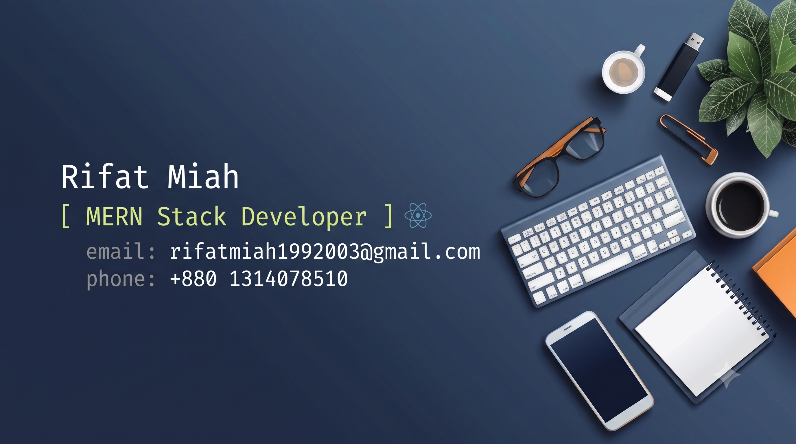

</img>

 
<!-- Animated Typing Intro -->
  

    
  

  

    
    
    
  

---

## About Me 

Hi there! I'm <b>Rifat Miah</b>. I'm a passionate **Junior Full Stack Developer** with a strong focus on **MERN-stack** technologies like React.js and Node.js. I love **sharing knowledge and teaching** through educational content. If you want to learn more about what I do and read my **Articles**, you can follow me. Outside of coding, I enjoy **writing and reading technical articles**.

<h3>When I code, I rely on</h3>
 

| Category | Technologies |
| :--- | :--- |
| **Languages & Core** |  |
| **Frontend Frameworks** |  |
| **Backend & Auth** |  |
| **Databases & Cloud** |  |
| **Dev Tools & Platforms** |  |

 
<h2 align="center">⚡ Stats ⚡</h2>
<table>
  <tr>
    <td align="center">
      
    </td>
    <td align="center">
      
    </td>
  </tr>
</table>

 
  

  

 

  

 
 

<h2 align="center">⚡ Connect with Me & Contact ⚡</h2>

 

Feel free to reach out to discuss **Junior Full-Stack Development** opportunities, project collaborations, or just to share knowledge! I'm always open to connecting with fellow developers and tech enthusiasts.

 
 

  
  <!-- Modern Grid Contact System -->
  <table border="0" cell-padding="10">
    <tr>
      <td>
        
      </td>
      <td>
        
      </td>
    </tr>
    <tr>
      <td>
        
      </td>
      <td>
        
      </td>
    </tr>
  </table>

 
  <!-- Animated Futuristic Footer -->

---
Let's build something impactful together!

